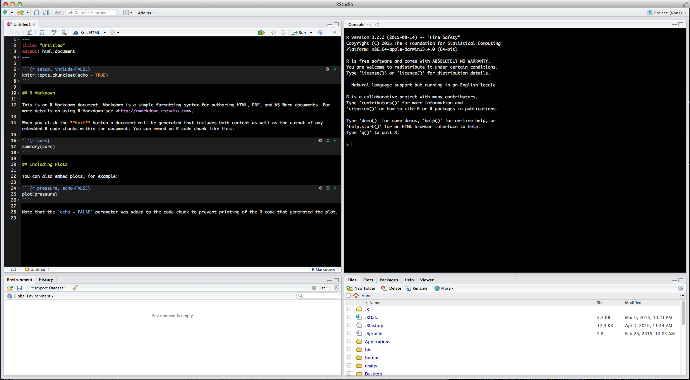

--- 
title: "BeginneR: an introduction to R basics"
site: bookdown::bookdown_site
author: "John Doe"
date: "`r Sys.Date()`"
output: 
  bookdown::gitbook: default
description: "This is a minimal example of using the bookdown package to write a book. The output format for this example is bookdown::gitbook."
---

# Preamble 

This is an introduction to R. 

<!--chapter:end:index.Rmd-->

# Basics of R

> ## Learning Objectives
>
> * Articulating motivations for using R
> * Introduce participants to the RStudio interface
> * Point to relevant information on how to get help, and understand how to ask well formulated questions

R is a versatile, open source programming/scripting language that's useful both
for statistics but also data science. Inspired by the programming language S.

* Open source software under GPL.
* Superior (if not just comparable) to commercial alternatives. R has over 7,000 user contributed packages at this time. It's widely used both in academia and industry.
* Available on all platforms.
* Not just for statistics, but also general purpose programming.
* For people who have experience in programmming: R is both an object-oriented and a so-called [functional language](http://adv-r.had.co.nz/Functional-programming.html)
* Large and growing community of peers.


# Awesome R tools

### Knitr/R-markdown
Knitr is an R library that allows you to create dynamic code reports. 

**Example:**         
[This](https://www.buzzfeed.com/peteraldhous/spies-in-the-skies?utm_term=.vw6m6GNwGa#.mwZYqXjQXv) 
BuzzFeed article, reporting on government surveillance planes, included all of their [analysis](http://buzzfeednews.github.io/2016-04-federal-surveillance-planes/analysis.html) as
an R-markdown document.

### Shiny
Shiny is a web application framework built for R. 

**Example:**            
[This](http://shiny.rstudio.com/gallery/movie-explorer.html) is a shiny app to visualize and explore a movie dataset. 

### RStudio
RStudio is an IDE- an integrated development environment. It allows us to write,
execute, and debug R code. It also has several other nice features, accessible
through its GUI (graphical user interface), that make it easier to use R.

RStudio is such a popular tool among R users, that several other languages have tried to emulate it, such as Spyder for Python. 

Start RStudio -- Let's start learning about our tool.

Rstudio's layout includes 4 quadrants   
        
* Scripts        
* Console          
* Environment/History          
* Plotting/Packages/Help        
    


To adjust the layout of your quadrants go to Preferences > Pane Layout 


# Interacting with R

There are two main ways of interacting with R: using the console or by using
script files (plain text files that contain your code).

The console window is the place where R is
waiting for you to tell it what to do, and where it will show the results of a
command.  You can type commands directly into the console, but they will be
forgotten when you close the session. It is better to enter the commands in the
script editor, and save the script. This way, you have a complete record of what
you did, you can easily show others how you did it and you can do it again later
on if needed. You can copy-paste into the R console, but the Rstudio script
editor allows you to 'send' the current line or the currently selected text to
the R console using the `Ctrl-Enter` shortcut.

If R is ready to accept commands, the R console shows a `>` prompt. If it
receives a command (by typing, copy-pasting or sent from the script editor using
`Ctrl-Enter`), R will try to execute it, and when ready, show the results and
come back with a new `>`-prompt to wait for new commands.

If R is still waiting for you to enter more data because it isn't complete yet,
the console will show a `+` prompt. It means that you haven't finished entering
a complete command. This is because you have not 'closed' a parenthesis or
quotation. If you're in Rstudio and this happens, click inside the console
window and press `Esc`; this should help you out of trouble.


## Seeking help

### I know the name of the function I want to use, but I'm not sure how to use it

If you need help with a specific function, let's say `barplot()`, you can type:

```{r, eval=FALSE}
?barplot
```

If you just need to remind yourself of the names of the arguments, you can use:

```{r, eval=FALSE}
args(lm)
```

If the function is part of a package that is installed on your computer but
don't remember which one, you can type:

```{r, eval=FALSE}
??geom_point
```

### I want to use a function that does X, there must be a function for it but I don't know which one...

If you are looking for a function to do a particular task, you can use
`help.search()` (but only looks through the installed packages):

```{r, eval=FALSE}
help.search("kruskal")
```

If you can't find what you are looking for, you can use the
[rdocumention.org](http://www.rdocumentation.org) website that search through
the help files across all packages available.

### I am stuck... I get an error message that I don't understand

Start by googling the error message. However, this doesn't always work very well
because often, package developers rely on the error catching provided by R. You
end up with general error messages that might not be very helpful to diagnose a
problem (e.g. "subscript out of bounds").

However, you should check stackoverflow. Search using the `[r]` tag. Most
questions have already been answered, but the challenge is to use the right
words in the search to find the answers:
[http://stackoverflow.com/questions/tagged/r](http://stackoverflow.com/questions/tagged/r)

The [Introduction to R](http://cran.r-project.org/doc/manuals/R-intro.pdf) can
also be dense for people with little programming experience but it is a good
place to understand the underpinnings of the R language.

The [R FAQ](http://cran.r-project.org/doc/FAQ/R-FAQ.html) is dense and technical
but it is full of useful information.

### Asking for help

The key to get help from someone is for them to grasp your problem rapidly. You
should make it as easy as possible to pinpoint where the issue might be.

Try to use the correct words to describe your problem. For instance, a package
is not the same thing as a library. Most people will understand what you meant,
but others have really strong feelings about the difference in meaning. The key
point is that it can make things confusing for people trying to help you. Be as
precise as possible when describing your problem

If possible, try to reduce what doesn't work to a simple reproducible
example. If you can reproduce the problem using a very small `data.frame`
instead of your 50,000 rows and 10,000 columns one, provide the small one with
the description of your problem. When appropriate, try to generalize what you
are doing so even people who are not in your field can understand the question.

If you want to share your object, provide either the raw file (i.e., your CSV file) with
your script up to the point of the error (and after removing everything that is
not relevant to your issue). Alternatively, in particular if your questions is
not related to a `data.frame`, you can save any R object to a file:

```{r, eval=FALSE}
saveRDS(iris, file="/tmp/iris.rds")
```

The content of this file is however not human readable and cannot be posted
directly on stackoverflow. It can however be sent to someone by email who can read
it with this command:

```{r, eval=FALSE}
some_data <- readRDS(file="~/Downloads/iris.rds")
```

Last, but certainly not least, **always include the output of `sessionInfo()`**
as it provides critical information about your platform, the versions of R and
the packages that you are using, and other information that can be very helpful
to understand your problem.

```{r, results='show'}
sessionInfo()
```

### Where to ask for help?

* Your friendly colleagues: if you know someone with more experience than you,
  they might be able and willing to help you.
* Stackoverflow: if your question hasn't been answered before and is well
  crafted, chances are you will get an answer in less than 5 min.
* The [R-help](https://stat.ethz.ch/mailman/listinfo/r-help): it is read by a
  lot of people (including most of the R core team), a lot of people post to it,
  but the tone can be pretty dry, and it is not always very welcoming to new
  users. If your question is valid, you are likely to get an answer very fast
  but don't expect that it will come with smiley faces. Also, here more than
  everywhere else, be sure to use correct vocabulary (otherwise you might get an
  answer pointing to the misuse of your words rather than answering your
  question). You will also have more success if your question is about a base
  function rather than a specific package.
* If your question is about a specific package, see if there is a mailing list
  for it. Usually it's included in the DESCRIPTION file of the package that can
  be accessed using `packageDescription("name-of-package")`. You may also want
  to try to email the author of the package directly.
* There are also some topic-specific mailing lists (GIS, phylogenetics, etc...),
  the complete list is [here](http://www.r-project.org/mail.html).

### More resources

* The [Posting Guide](http://www.r-project.org/posting-guide.html) for the R
  mailing lists.
* [How to ask for R help](http://blog.revolutionanalytics.com/2014/01/how-to-ask-for-r-help.html)
  useful guidelines

<!--chapter:end:01-what-is-R.Rmd-->

# Vectors and datatypes 

------------

> ## Learning Objectives
>
> * Familiarize participants with R syntax
> * Understand the concepts of objects and assignment
> * Understand the concepts of vectors and data types
> * Get exposed to a few functions

------------

## The R syntax


## Creating objects

```{r, echo=FALSE, purl=TRUE}
### Creating objects (assignments)
```

You can get output from R simply by typing in math in the console

```{r, purl=FALSE}
3 + 5
12/7
2*4
2^4
```

We can also comment what it is we're doing

```{r, purl=FALSE}
# I am adding 3 and 5. R is fun!
3 + 5
```

What happens if we do that same command without the # sign in the front?

```{r, purl=FALSE, eval=FALSE}
I am adding 3 and 5. R is fun!
3 + 5
```

Now R is trying to run that sentence as a command, and it 
doesn't work. Now we're stuck over in the console. The 
`+` sign means that it's still waiting for input, so we 
can't type in a new command. To get out of this type `Esc`. This will work whenever you're stuck with that `+` sign. 

It's great that R is a glorified caluculator, but obviously
we want to do more interesting things. 

To do useful and interesting things, we need to assign _values_ to
_objects_. To create objects, we need to give it a name followed by the
assignment operator `<-` and the value we want to give it.

## Assignment operator


For instance, instead of adding 3 + 5, we can assign those
values to objects and then add them.

```{r, purl=FALSE}
# assign 3 to a
a <- 3
# assign 5 to b
b <- 5

```

```{r}
# what now is a
a
# what now is b
b
# Add a and b
a + b
```

`<-` is the assignment operator. It assigns values on the right to objects on
the left. So, after executing `x <- 3`, the value of `x` is `3`. The arrow can
be read as 3 **goes into** `x`.  You can also use `=` for assignments but not in
all contexts so it is good practice to use `<-` for assignments. `=` should only
be used to specify the values of arguments in functions, see below.

In RStudio, typing `Alt + -` (push `Alt`, the key next to your space bar at the
same time as the `-` key) will write ` <- ` in a single keystroke.

To view which objects we have stored in memory, we can use the `ls()` command

```{r, purl=FALSE}
ls()
```

To remove objects we can use the `rm()` command
```{r, purl=FALSE}
rm(a)
```
### Exercise 

- What happens if we change `a` and then re-add `a` and `b`?
- Does it work if you just change `a` in the script and then add `a` and `b`? Did you still get the same answer after they changed `a`? If so, why do you think that might be?
- We can also assign a + b to a new variable, `c`. How would you do this?

## Notes on objects

Objects can be given any name such as `x`, `current_temperature`, or
`subject_id`. You want your object names to be explicit and not too long. They
cannot start with a number (`2x` is not valid but `x2` is). R is case sensitive
(e.g., `my_data` is different from `My_data`). There are some names that
cannot be used because they represent the names of fundamental functions in R
(e.g., `if`, `else`, `for`, see
[here](https://stat.ethz.ch/R-manual/R-devel/library/base/html/Reserved.html)
for a complete list). In general, even if it's allowed, it's best to not use
other function names (e.g., `c`, `T`, `mean`, `data`, `df`, `weights`). In doubt
check the help to see if the name is already in use. It's also best to avoid
dots (`.`) within a variable name as in `my.dataset`. There are many functions
in R with dots in their names for historical reasons, but because dots have a
special meaning in R (for methods) and other programming languages, it's best to
avoid them. It is also recommended to use nouns for variable names, and verbs
for function names. It's important to be consistent in the styling of your code
(where you put spaces, how you name variable, etc.). In R, two popular style
guides are [Hadley Wickham's](http://adv-r.had.co.nz/Style.html) and
[Google's](https://google-styleguide.googlecode.com/svn/trunk/Rguide.xml).

When assigning a value to an object, R does not print anything. You can force to
print the value by using parentheses or by typing the name:


## Functions

The other key feature of R are functions. These are R's built in capabilities. Some examples of these are mathematical functions, like
`sqrt` and `round`. You can also get functions from libraries (which we'll talk about in a bit), or even write your own. 

## Functions and their arguments

Functions are "canned scripts" that automate something complicated or convenient
or both.  Many functions are predefined, or become available when using the
function `library()` (more on that later). A function usually gets one or more
inputs called *arguments*. Functions often (but not always) return a *value*. A
typical example would be the function `sqrt()`. The input (the argument) must be
a number, and the return value (in fact, the output) is the square root of that
number. Executing a function ('running it') is called *calling* the function. An
example of a function call is:

`sqrt(a)`

Here, the value of `a` is given to the `sqrt()` function, the `sqrt()` function
calculates the square root. This function is very simple, because it takes just one
argument. 

The return 'value' of a function need not be numerical (like that of `sqrt()`),
and it also does not need to be a single item: it can be a set of things, or
even a data set. We'll see that when we read data files in to R. 

Arguments can be anything, not only numbers or filenames, but also other
objects. Exactly what each argument means differs per function, and must be
looked up in the documentation (see below). If an argument alters the way the
function operates, such as whether to ignore 'bad values', such an argument is
sometimes called an *option*.

Most functions can take several arguments, but many have so-called *defaults*.
If you don't specify such an argument when calling the function, the function
itself will fall back on using the *default*. This is a standard value that the
author of the function specified as being "good enough in standard cases". An
example would be what symbol to use in a plot. However, if you want something
specific, simply change the argument yourself with a value of your choice.

Let's try a function that can take multiple arguments `round`.

```{r, results='show'}
round(3.14159)
```

We can see that we get `3`. That's because the default is to round
to the nearest whole number. If we want more digits we can see 
how to do that by getting information about the `round` function.
We can use `args(round)` or look at the
help for this function using `?round`.

```{r, results='show'}
args(round)
```

```{r, eval=FALSE}
?round
```


We see that if we want a different number of digits, we can 
type `digits=2` or however many we want.

```{r, results='show'}
round(3.14159, digits = 2)
```

If you provide the arguments in the exact same order as they are defined you don't have to name them:

```{r, results='show'}
round(3.14159, 2)
```

However, it's usually not recommended practice because it's a lot of remembering
to do, and if you share your code with others that includes less known functions
it makes your code difficult to read. (It's however OK to not include the names
of the arguments for basic functions like `mean`, `min`, etc...)

Another advantage of naming arguments, is that the order doesn't matter.
This is useful when there start to be more arguments. 


## Vectors and data types


A vector is the most common and basic data structure in R, and is pretty much
the workhorse of R. It's basically just a list of values, mainly either numbers or
characters. They're special lists that you can do math with. You can assign this list of values to a variable, just like you
would for one item. You can add elements to your vector simply by using the `c()` function, which stands for combine:


```{r}
one_to_five <- c(1, 2, 3, 4, 5)
one_to_five <- 1:5
one_to_five
```

A vector can also contain characters:

```{r}
primary_colors <- c("red", "yellow", "blue")
primary_colors
```

There are many functions that allow you to inspect the content of a
vector. `length()` tells you how many elements are in a particular vector:

```{r}
length(one_to_five)
length(primary_colors)
```


You can also do math with whole vectors. For instance if we wanted to multiply all the values in our vector by a scalar, we can do

```{r}
5 * one_to_five
```

or we can add the data in the two vectors together

```{r}
two_to_ten <- one_to_five + one_to_five
two_to_ten
```

This is very useful if we have data in different vectors that we 
want to combine or work with. 

There are few ways to figure out what's going on in a vector. 

`class()` indicates the class (the type of element) of an object:

```{r}
class(one_to_five)
class(primary_colors)
```


```{r}
new_digits <- c(one_to_five, 90) # adding at the end
new_digits <- c(30, new_digits) # adding at the beginning
new_digits
```

What happens here is that we take the original vector `one_to_five`, and we are
adding another item first to the end of the other ones, and then another item at
the beginning. We can do this over and over again to build a vector or a
dataset. As we program, this may be useful to autoupdate results that we are
collecting or calculating.

We just saw 2 of the **data types** that R uses: `"character"` and
`"integer"`. The others you will likely encounter during data analysis are:       

* `"logical"` for `TRUE` and `FALSE` (the boolean data type)
* `"numeric"` for floating point decimal numbers      
* `"factor"` for categorical data. Similar to `"character"` data, but factors have levels   
   

Importantly, a vector can only contain **one** data type. If you combine multiple data types
in a vector with the `c()` command, R will try to coerce all the values to the same data type.
If it cannot, it will throw an error. 
    
For example, what data type is our `one_to_five` vector if we divide it by 2?
```{r}
divided_integers <- one_to_five/2
divided_integers

class(divided_integers)
```

Vectors are indexed sets, which means that every value can be referred to by its order in the vector. 
R indexes start at 1. Programming languages like Fortran, MATLAB, and R start
counting at 1, because that's what human beings typically do. Languages in the C
family (including C++, Java, Perl, and Python) count from 0 because that's
simpler for computers to do.

We can index a vector in many different ways. We can specify a position of a single value, a range of values, or a vector of values. We can even specify which values to remove by their indices. 
```{r}
one_to_five[3]
one_to_five[1:3]
one_to_five[c(1, 3, 5)]
one_to_five[-2]
```

## Other data structures
Vectors are one of the many **data structures** that R uses. Other important
ones are lists (`list`), matrices (`matrix`), and data frames (`data.frame`) 


<!--chapter:end:02-vectors-and-datatypes.Rmd-->

# Data frames

------------

> ## Learning Objectives
>
> * load external data (CSV files) in memory 
> * understand the concept of a `data.frame`
> * know how to access any element of a `data.frame`
> * understand `factors` and how to manipulate them

------------

# Setup

The file required for this lesson can be downlaoded by clicking on this [link](./data/herding-cats-small.csv) 
(It will take you to the excel spreadsheet if you have Box synced on your computer. Otherwise you can simply download the entire folder on your computer.)

- Move the downloaded file into the directory for this workshop

To view your current working directory use the `getwd()` command

```{r, eval=FALSE, echo=FALSE}
getwd()
```

To set you working directory, use the `setwd()` command. We want to set the working directory to the location of our project. For example: 
```{r, eval=FALSE}
setwd("~/GitHub/BeginneR/R codes")
```


# Looking at data


You are now ready to load the data. We are going to use the R function  `read.csv()` to load the data file into memory (as a `data.frame`). In this case, our data is in a subdirectory called "data". 

```{r}
cats <- read.csv(file = 'data/herding-cats-small.csv')
```


This statement doesn't produce any output because assignment doesn't display
anything. If we want to check that our data has been loaded, we can print the
variable's value: `cats`.

```{r}
cats
```

However, if our dataset was larger, we probably wouldn't want to print the whole
thing to our console. Instead, we can use the `head` command to view the first six
lines or the `View` command to open the dataset in a spreadsheet-like viewer. 

```{r, eval=FALSE}
head(cats)
View(cats)
```

We've just done two very useful things.         
1. We've read our data in to R, so now we can work with it in R           
2. We've created a data frame (with the `read.csv` command) the 
standard way R works with data.        

# What are data frames?

`data.frame` is the _de facto_ data structure for most tabular data and what we
use for statistics and plotting.

A `data.frame` is actually a `list` of vectors of identical lengths. Each vector
represents a column, and each vector can be of a different data type (e.g.,
characters, integers, factors). The `str()` function is useful to inspect the
data types of the columns.

A `data.frame` can be created by the functions `read.csv()` or `read.table()`, in
other words, when importing spreadsheets from your hard drive (or the web).

By default, `data.frame` converts (= coerces) columns that contain characters
(i.e., text) into the `factor` data type. Depending on what you want to do with
the data, you may want to keep these columns as `character`. To do so,
`read.csv()` and `read.table()` have an argument called `stringsAsFactors` which
can be set to `FALSE`:

Let's now check the structure of this `data.frame` in more details with the
function `str()`:

```{r}
str(cats)
```

# Inspecting `data.frame` objects

We already saw how the functions `head()` and `str()` can be useful to check the
content and the structure of a `data.frame`. Here is a non-exhaustive list of
functions to get a sense of the content/structure of the data.

* Size:
    * `dim()` - returns a vector with the number of rows in the first element, and
    the number of columns as the second element (the dimensions of the object)
    * `nrow()` - returns the number of rows
    * `ncol()` - returns the number of columns
* Content:
    * `head()` - shows the first 6 rows
    * `tail()` - shows the last 6 rows
* Names:
    * `names()` - returns the column names (synonym of `colnames()` 
    for `data.frame` objects)             
    * `rownames()` - returns the row names  
* Summary:    
    * `str()` - structure of the object and information about the class, length and
	content of  each column         
    * `summary()` - summary statistics for each column         

Note: most of these functions are "generic", they can be used on other types of
objects besides `data.frame`.


## Indexing `data.frame` objects


Our cats data frame has rows and columns (it has 2 dimensions), if we want to
extract some specific data from it, we need to specify the "coordinates" we want
from it. Row numbers come first, followed by column numbers (i.e. [row, column]).

```{r eval=FALSE}
cats[1, 2]   # first element in the 2nd column of the data frame
cats[1, 6]   # first element in the 6th column
cats[1:3, 7] # first three elements in the 7th column
cats[3, ]    # the 3rd element for all columns
cats[, 7]    # the entire 7th column
head_meta <- cats[1:6, ] # Row 1-6 which is the same as head
```


For larger datasets, it can be tricky to remember the column number that
corresponds to a particular variable. (Are species names in column 5 or 7? oh,
right... they are in column 6). In some cases, in which column the variable will
be can change if the script you are using adds or removes columns. It's
therefore often better to use column names to refer to a particular variable,
and it makes your code easier to read and your intentions clearer.

You can do operations on a particular column, by selecting it using the `$`
sign. In this case, the entire column is a vector. You can use
`names(cats)` or `colnames(cats)` to remind yourself of the column names.
For instance, to extract all the cats' weight information from our dataset:

```{r}
cats$weight
```

In some cases, you may way to select more than one column. You can do this using
the square brackets, passing in a vector of the columns to select. Suppose we wanted weight and coat information:

```{r}
cats[ , c("weight", "coat")]
```

You can even access columns by column name _and_ select specific rows of interest. For example, if we wanted the weight and coat of just rows
4 through 7, we could do:

```{r}
cats[4:7, c("weight", "coat")]
```

We can can also use logical statements to select and filter items from a `data.frame`. For example, to select all rows with black cats we could use the following statement

```{r}
cats[cats$coat == "black", ]

```

let's break this down a bit. The logical statement in the brackets returns a vector of `TRUE` and `FALSE` values. 

```{r}
cats$coat == "black"
```

These `booleans` allow us to select which records we want from our `data.frame`

Another way to do this is with the function `which()`. `which()` finds the indexes of records meeting a logical statement
```{r}
which(cats$coat == "black")

```

So, we could also write 
```{r}
cats[which(cats$coat == "black"), ]
```
But that's getting really long and ugly. R is already considered somewhat of an ugly duckling among programming languages, so no reason to play into the stereotype.

We can combine logical statements and index statements
```{r}
cats[cats$coat == "black", c("coat", "weight")]

```

Finally, we can use `&`, the symbol for "and", and `|`, the symbol for "or", to make logical statements.

```{r}
cats[cats$coat == "black" & cats$roamer == "no", ]

```
This statement selects all records with black cats that also like string

## Factors

Factors are used to represent categorical data. Factors can be ordered or
unordered and are an important class for statistical analysis and for plotting.

Factors are stored as integers, and have labels associated with these unique
integers. While factors look (and often behave) like character vectors, they are
actually integers under the hood, and you need to be careful when treating them
like strings.

In the data frame we just imported, let's do 
```{r}
str(cats)
```

We can see the names of the multiple columns. And, we see that 
coat is a `Factor w/ 5 levels`

When we read in a file, any column that contains text is automatically
assumed to be a factor. Once created, factors can only contain a pre-defined set values, known as
*levels*. By default, R always sorts *levels* in alphabetical order. 


You can check this by using the function `levels()`, and check the
number of levels using `nlevels()`:

```{r}
levels(cats$coat)
nlevels(cats$coat)
```

Sometimes, the order of the factors does not matter, other times you might want
to specify the order because it is meaningful (e.g., "low", "medium", "high") or
it is required by particular type of analysis. Additionally, specifying the
order of the levels allows to compare levels:

```{r, error=TRUE}
satisfaction <- factor(c("low", "high", "medium", "high", "low", "medium", "high"))
levels(satisfaction)
satisfaction <- factor(satisfaction, levels = c("low", "medium", "high"))
levels(satisfaction)
min(satisfaction) ## doesn't work
satisfaction <- factor(satisfaction, levels = c("low", "medium", "high"), ordered = TRUE)
levels(satisfaction)
min(satisfaction) ## works!
```

In R's memory, these factors are represented by numbers (1, 2, 3). They are
better than using simple integer labels because factors are self describing:
`"low"`, `"medium"`, and `"high"`" is more descriptive than `1`, `2`, `3`. Which
is low?  You wouldn't be able to tell with just integer data. Factors have this
information built in. It is particularly helpful when there are many levels
(like the species in our example data set).

### Converting factors

If you need to convert a factor to a character vector, simply use
`as.character(x)`.

Converting a factor to a numeric vector is however a little trickier, and you
have to go via a character vector. Compare:

```{r}
f <- factor(c(1, 5, 10, 2))
as.numeric(f)               ## wrong! and there is no warning...
as.numeric(as.character(f)) ## works...
as.numeric(levels(f))[f]    ## The recommended way.
```


<!--chapter:end:03-data-frames.Rmd-->

# R packages and markdowns 

------------

> ## Learning Objectives
>
> * Know what packages are and how to install them from CRAN
> * Understand why literate programming is useful
> * Create and edit an RMarkdown file
> * Know how to manipulate some common chunk options

------------

# Packages

Packages are bundles of code which extend the functionality of R.

Anyone can make an R package, and anyone can install anyone else's R package (if they make it available). This is part of the beauty of open source, and using different R packages is essential to modern R workflows.

You can get packages from many different places, but we'll focus on just the most common one: [CRAN](https://cran.r-project.org). CRAN is the Comprehensive R Archive Network, a global network of servers which make available for download a set of vetted R packages.

The next section is about RMarkdown, a package, so we'll install that now.


## Installation

To download and install a package from CRAN, call the `install.packages` command on a string with the name of the desired package. You will get output describing the installation progress.

```{r, eval = TRUE}
install.packages("rmarkdown", repos="http://cran.rstudio.com/")
```

You may be asked to choose a mirror; the RStudio mirror is a good choice as it will pick the nearest mirror automatically. This will also download and install packages which RMarkdown depends on.

You only need to install a package once per machine, unless you need to update an already-installed package. Calling `install.packages` for an existing package will update it if there's a more recent version on CRAN than on your machine.

You can view all of the installed packages using the `installed.packages` command. This will output a lot of information for each package, so if you only want a list of the installed package names, you can specify that you want the "Package" column. I like to look at this as a vector.

```{r, eval = TRUE}
head(as.vector(installed.packages()[,"Package"]))
```


## Loading

Most packages need to be loaded into the current environment to be accessible. RMarkdown is specially integrated in RStudio in a way that avoids this, but in general we load packages with the `library` command:

```{r, eval = F}
library(rmarkdown)  # notice the lack of quotes
```

This will come up again later in the lesson on `dplyr`, an external package that _does_ need to be loaded.

You can also view the packages that you have loaded into your workspace.

```{r, eval = TRUE}
head(.packages())
```


# R Markdown

R Markdown is a special file format which allows us to combine text, code, _and the output of that code_ in a single file. This combination of explanation, code, and results is called _literate programming_ and is a powerful way to share research and data explorations.

RMarkdown is an extended version of the Markdown (`.md`) file format, which is an easy way to make nicely formatted text documents without endlessly tinkering with the formatting (as you might with LaTeX). The software community loves Markdown because in addition to being straightforward, it has good support for formatting code, which can be a pain in other formats.

RMarkdown takes this a step further by allowing you to _run_ the code in your document, and having the output appear below the code that made it.

If you've used ipython/Jupyter notebooks before, R Markdown will feel similar. All the lessons in this workshop were created with R Markdown!


## My First Rmd

Rstudio makes it easy to create a new RMarkdown file, and it even starts with a demo file that shows off most of the basic features of the `Rmd` format. In the upper-left corner, click the "new file" icon and select RMarkdown. A window should appear to help you configure this file initially. There's a lot of options (R Markdown can do so much!), but for now, make sure your name is in the "Author" field, and change the "Title" to be something like "CMDA Assignment".

Before we delve into what each of these pieces mean, let's "knit" the document so we can see what kind of output RMarkdown produces. Above the file, press the `knit` button, the one that looks like a ball of yarn.

You should see a new pane open in RStudio that shows R "knitting" the document, and when it's done, a pop-up will appear showing the knitted output.

This new output being displayed as an `html` file; look in the file browser pane, and you'll see a `.html` file next to your `.Rmd` file (may need to refresh), because RStudio automatically saved this output when the document finished knitting.

Let's look at the individual pieces in this document:

### Header
This is the section at the top, with three dashes before and after. This lists some metadata about the object. The title, date, and author form the start of the output document, and the `output:` line instructs the knitting process to generate an html file.

### Section Titles
You can enlarge text be preceding it with one or more pound signs (`#`). This is mainly useful for organizing a document into sections. The more pound signs, the smaller the text, so when you make sub-section you should add at least one more pound sign than used in the parent sections' title.

### Link
You can make text clickable by including a link to a different website. An example can be found above, where we included a link to [CRAN](https://cran.r-project.org).

There are two parts to creating linked text. The first part is including the text you want to see, surrounded by square brackets `[CRAN]`. Immediately after that, add the link surrounded by parentheses `(https://cran.r-project.org)`. The final product looks like `[CRAN](https://cran.r-project.org)`.

### Bold/Italic Text
The double-asterisks surrounding the word "Knit" in the second paragraph cause that piece of text to be bold. This phrase can be multiple words, but should not have spaces immediately on the inside of the asterisks. You can make text italix by similarly wrapping in underscores (`_`) or using single asterisks.

### Code Chunks
This is the real meat of the document! An R Markdown code chunk is a section which starts and ends with triple-backticks (\`, not `'`). After the initial set, the curly-bracketed section which starts with `{r` is what forces this to be ran as R code; without this piece, the section would get formatted like code, but would not be executed when knitting. The phrase after the `r` is the _chunk name_. Chunks do not need to be named, but no two chunks can have the same name. Naming chunks can help keep code organized and make it easier to track down the source of errors when they occur.

#### Chunk Options
As the second default section discusses, we can hide the code in a code chunk by placing a comma after out chunk name and setting an option `echo=FALSE`. The code will still execute, and its output will be inserted in the knitted document, but it will not be shown.

Similarly, you can set `eval=FALSE` to avoid running a code chunk.


## Digging Deeper
There's a lot more to RMarkdown than just this; as the demo document shows, you can visit <http://rmarkdown.rstudio.com> to learn more.

We'll be using R Markdown for the rest of this workshop to keep a running log of what we're learning. This will allow you to walk away with a knit document which has not only the code commands you've learned to use, but the output of those commands and some explanatory text. That's literate programming!

<!--chapter:end:04-packages-and-rmarkdown.Rmd-->

# `dplyr`

```{r loading, echo = FALSE}
cats <- read.csv("data/herding-cats-small.csv")
```


80% of the work involved with data analysis involves cleaning and shaping the data until it's in the state you need. Bracket subsetting is handy, but it can be cumbersome and difficult to read, especially for complicated operations. Enter `dplyr`!

`dplyr` is a package for making data manipulation easier. (It does a lot more too, but this is what we'll focus on).

Unlike the subsetting commands we've already worked on, `dplyr` is designed to be highly expressive, and highly readable. It's structured around a set of verbs, or grammar of data manipulation. The core functions we'll talk about are below:

- `select`
- `arrange`
- `filter`
- `group_by`
- `mutate`
- `summarise/summarize`

## Getting the package

```{r, eval = FALSE}
install.packages("dplyr")
```
Again, you may be asked to choose a CRAN mirror; RStudio is a good choice.

Unlike the `rmarkdown` package, we'll be using `dplyr` in the console. In order to do that, we need to _load_ the package into our environment so we can access functions from `dplyr`. We do this with the `library` command:

```{r, message = FALSE}
library("dplyr")
```

You only need to install a package once per computer, but you need to load it
every time you open a new R session and want to use that package.

## Subsetting Data

The first two `dplyr` commands we'll use help us to subset our data by rows and columns.

### `select`
The first command we'll use is `select`, which allows us to choose columns from our dataset. Let's use our `cats` dataset and select only the `coat` column; we did this previously with

```{r}
cats[, "coat"]
```

With dplyr, we don't need to enclose our column names in quotes

```{r}
select(cats, coat)
```

Notice how the output differs slightly; all the main `dplyr` verbs behave consistently in that their inputs and outputs are both `data.frame`s, rather than returning a simple vector as the bracket-indexing method did. All of the main "verbs" we'll talk about will return a data.frame as their result.

We can select more columns by giving `select` additional arguments, and our output `data.frame` will have columns according to the order of our arguments

```{r}
select(cats, coat, cat_id)
```

### `filter`
So where `select` allowed us to select _columns_, `filter` operated on _rows_. Say we want to see the all the cats with black coats; we saw earlier how to use that using bracket-indexing:

```{r}
cats[cats$coat == "black", ]
```

In dplyr, this looks like

```{r}
filter(cats, coat == "black")
```

Notice we don't have to use the `$` operator to tell `filter` where the `coat` column is; it's smart enough to assume we want the `coat` column from the `data.frame` we passed in.

### `arrange`
Maybe you have a set of observations in your data that you want to organize by their value.  `arrange` allows us to change the order of rows in our dataset based on their values.

```{r}
arrange(cats, coat)

# you can include additional columns to help sort the data
arrange(cats, coat, sex)
```

### `mutate`

One common task in working with data is updating/cleaning some of the values in columns. `mutate` allows us to do this relatively easily. Let's say I don't want a lot of decimal places in one of my measurements. I can use `mutate` to update my existing variable:

```{r}
mutate(cats, weight = round(weight, 2))
```

Another common task is generating a new column based on values that are already in the dataset you are working on. `mutate` helps us do this, and tacks a new column to the end of our data.frame.

```{r}
# let's say you want to add two variables together
mutate(cats, new_variable = age + weight)

# you can include as many new variables as you want, separated by a comma
mutate(cats, new_var_1 = age + weight, new_var_2 = age * weight)
```


## Pipes
You'll often find yourself needing to use multiple functions in a row to organize some data that you're working on. This can sometimes lead to dense code that is difficult to read.

```{r}
# for example
sort(round(sqrt(cats$age * 2), 3))
```

In the code above, I have multiple steps to get my result, but you have to read what's going on from the inside out. This can be cumbersome, especially if you need to understand how one function's output influences the next operation.

### Using Pipes

`dplyr` includes a special operator designed to make code *flow* and appear more readable.

It's written as `%>%`, and you can call it the "pipe" operator.

Our example above can be re-written as:
```{r}
cats$age * 2 %>% 
  sqrt() %>%
  round(3) %>%
  sort()
```

Instead of being nested within a bunch of commands, you can see read the code as a series of statements:
  1. Multiply `cats$age` by 2, *then*
  2. Take the square-root of these values, *then*
  3. Round the result to the 3rd digit, *then*
  4. Sort the values in ascending order

I encourage you to think of the `%>%` as short-hand for "then", when reading code that uses it!

"Pipe" operators are found in other languages; they get their name from the idea that your code can be thought of as a "pipeline". 

Let's look at another example.
```{r}
round(1.23456789, 3)
```

We can use a pipe operator to acheive the same thing.

```{r}
1.23456789 %>% round(3)
```

The pipe takes care of making sure the output of the expression on the left-hand-side (a simple numeric, in this case) is inserted as the first argument of the expressing on the right-hand-side. We can also pipe into other argument positions by using a period as a placeholder.

```{r}
3 %>% round(1.23456789, .)
```

These are contrived examples, and I don't suggest using pipes for simple operations like rounding. The pipes really become useful when chaining together multiple operations in sequence, as we'll do with our `dplyr` functions.


## Combining Select & Filter

The pipe is really helpful when combined with the data-manipulation of `dplyr`. 
Remember how we used `filter` to select only the black cats? What if we only want to see the ID's of those cats, rather than all the info about them? We've already seen we can use `select` to pick out certain columns. We can use that to select the `cat_id` column from our `filter`ed dataset like so

```{r}
# reading from the inside out
select(filter(cats, coat == "black"), cat_id)
```

That might not look too bad now, but what if we wanted to do another operation on that output? We'd add another layer of nesting, and having to read that line from the inside-out can quickly become annoying. We can use the pipe operator to clean that up.

```{r}
# reading from left to right
filter(cats, coat == "black") %>% select(cat_id)
```

We could even add another pipe to feed `cats` into `filter`; it isn't necessary, but it makes it even easier to see what we're operating on in this chain of commands. We'll combine this with some line breaks to really make this easy to read:

```{r}
cats %>%
  filter(coat == "black") %>%
  select(cat_id)
```

### `summarize`

While `mutate` creates new columns, it's often useful to summarize multiple rows into a single value. Say we want to find the mean weight of all these cats; enter `summarize`! Like `mutate`, the arguments to summarize (after the `data.frame` we want to operate on) are expressions. We can combine `summarize` with the `mean` function to get a mean weight for our collection of cats like so:

```{r}
cats %>% summarize(mean_weight = mean(weight))
```

Notice how we have only a single value returned, but it's still in a `data.frame` format. This is subtle, but important; all these basic `dplyr` verbs take in `data.frame`s and also return `data.frame`s. This consistency helps make long chains of `dplyr` operations possible.


### `group_by`

A very common data analysis task is to do operations like we did above, but to do them on a group-by-group basis. To do this with `dplyr`, we'll use the `group_by` function.

Let's look at the mean weights of our cats, grouping up by coat. This will give us the mean weight of the black cats, mean weight of the calico cats, etc. We can do this by inserting a `group_by` function into our earlier expression for computing mean weight:

```{r}
cats %>%
  group_by(coat) %>%
  summarize(mean_weight = mean(weight))
```

Ta-da!

We can also use `mutate` on a per-group basis. Let's make a new column which centers our weights around zero; this can be done by subtracting the group's mean weight from each cat's weight:

```{r}
cats %>%
  group_by(coat) %>%
  mutate(centered_weight = weight - mean(weight))
```

# Going further

This is an introductory look at `dplyr`, just enough to make you dangerous. As you continue your R journey I suggest looking into the other awesome things you can do with this package!


<!--chapter:end:05-dplyr.Rmd-->

# Data visualization in R 

---

> ## Learning Objectives {.objectives}
>
> * Grammar of graphics concepts (geoms, aesthetics)
> * Advanced plots (scales, facets, themes)
> * Writing images (and other things) to file

# Basic plots in R

When we are working with large sets of numbers it can be useful to display that information graphically. R has a number of built-in tools for basic graph types such as hisotgrams, scatter plots, bar charts, boxplots and much [more](http://www.statmethods.net/graphs/). We'll test a few of these out here on the `cats` data.


```{r import data}
cats <- read.csv("data/herding-cats.csv")
```

## Scatterplot
Let's start with a **scatterplot**. A scatter plot provides a graphical view of the relationship between two sets of numbers.

Let's make a scatterplot of birth weight by mother's age.

```{r scatter-plot1, fig.align='center'}
plot(x = cats$age, y = cats$weight)
```

Each point represents a row in our dataset. The value on the x-axis is the mother's age and the values on the y-axis correspond to the birth weight for the infant. For any plot you can customize many features of your graphs (fonts, colors, axes, titles) through [graphic options](http://www.statmethods.net/advgraphs/parameters.html)

# Advanced figures (`ggplot2`)

More recently, R users have moved away from base graphic options and towards a plotting package called `ggplot2` that adds a lot of functionality to the basic plots seen above. The syntax is different but it’s extremely powerful and flexible. We can start by re-creating some of the above plots but using ggplot functions to get a feel for the syntax.

```{r install ggplot2, eval=FALSE}
install.packages("ggplot2")
```

Load the `ggplot2` package.

```{r load ggplot2}
library(ggplot2)
```

The `ggplot()` function is used to initialize the basic graph structure, then we add to it. The basic idea is that you specify different parts of the plot, and add them together using the + operator.

We will start with a blank plot and will find that you will get an error, because you need to add layers.

```{r, fig.align='center'}
ggplot(cats)
```

Geometric objects are the actual marks we put on a plot. Examples include:

* points (geom_point, for scatter plots, dot plots, etc)
* lines (geom_line, for time series, trend lines, etc)
* boxplot (geom_boxplot, for, well, boxplots!)

A plot must have at least one geom; there is no upper limit. You can add a geom to a plot using the `+` operator.

```{r, eval=FALSE}
ggplot(cats) +
    geom_point()
```

Each type of geom usually has a required set of aesthetics to be set, and usually accepts only a subset of all aesthetics –refer to the geom help pages to see what mappings each geom accepts. Aesthetic mappings are set with the `aes()` function. 

Examples include:

* position (i.e., on the x and y axes)
* color (“outside” color)
* fill (“inside” color) shape (of points)
* linetype
* size

To start, we will add position for the x- and y-axis since geom_point requires mappings for x and y, all others are optional.

```{r, fig.align='center'}
ggplot(cats) +
    geom_point(aes(x = age, y = weight),
               color = "red",
               alpha = 0.5,
               shape = 1,
               size = 3)
```

##Scales

Scales control the mapping between data and aesthetics.

```{r}
ggplot(cats) +
    geom_point(aes(x = age, y = weight)) +
    scale_x_continuous(name = "Age",
                       breaks = c(1, 2, 3),
                       limits = c(-5, 15)) +
    scale_y_continuous("Weight", trans = "log") + 
    ggtitle(label = "Scatterplot")
```

## Themes

The ggplot2 theme system handles non-data plot elements such as:

* Axis labels
* Plot background
* Facet label backround
* Legend appearance

There are built-in themes we can use, or we can adjust specific elements. We can add additional aesthetics by mapping them to other variables in our dataframe. For example, the color of the boxplots will reflect low birth weight.

```{r, fig.align='center'}
ggplot(cats) +
    geom_point(aes(x = age, y = weight)) +
    theme_bw()
```

## Facets

Facets display subsets of the dataset in different panels. Let's use the `facet_grid` function to lay out panels in a grid. Each panel will have the same geometric objects.

```{r}, fig.align='center'}
ggplot(cats) +
    geom_point(aes(x = age, y = weight)) +
    xlab("Mother's age") +
    ylab("Birth weight") +
    facet_grid(. ~ coat) +
    theme_linedraw()
```

Here we have two panels one for each factor level of `coat`. The panels are layed out in columns because the expression `. ~ coat` 

## Writing figures to file

There are two ways in which figures and plots can be output to a file (rather than simply displaying on screen).

The first (and easiest) is to export directly from the RStudio ‘Plots’ panel, by clicking on Export when the image is plotted. This will give you the option of png or pdf and selecting the directory to which you wish to save it to.

The second option is to use R functions in the console, allowing you the flexibility to specify parameters to dictate the size and resolution of the output image. Some of the more popular formats include `pdf()`, `png`, and `svg`.

Initialize a plot that will be written directly to a file using `pdf`, `png` etc. Within the function you will need to specify a name for your image, and the with and height (optional). Then create a plot using the usual functions in R. Finally, close the file using the `dev.off()` function. There are also `bmp`, `tiff`, and `jpeg` functions, though the `jpeg` function has proven less stable than the others.

```{r, eval=FALSE}
ggplot(example_data) +
  geom_boxplot(aes(x = cit, y =....) +
  ggtitle(...) +
  xlab(...) +
  ylab(...) +
  theme(panel.grid.major = element_line(...),
          axis.text.x = element_text(...),
          axis.title = element_text(...),
          axis.text = element_text(...)
```

## Resources

We have only scratched the surface here. There are many plotting features we haven't covered.

plotting in Base R:

* John Maindonald's [Using R for Data Analysis and Graphics PDF](https://cran.r-project.org/doc/contrib/usingR.pdf)

ggplot2:

* [ggplot reference site](http://docs.ggplot2.org/)
* Winston Chang's excellent [Cookbook for R](http://www.cookbook-r.com)
* [ggplot2: Elegant Graphics for Data Anaysis](http://www.amazon.com/ggplot2-Elegant-Graphics-Data-Analysis/dp/0387981403)

Much of the material here was adpapted from [Introduction to R graphics with ggplot2 Tutorial at IQSS](http://tutorials.iq.harvard.edu/R/Rgraphics/Rgraphics.html).

<!--chapter:end:06-data-visualization.Rmd-->

# Basic statistics in R 


```{r, echo = FALSE, message = FALSE}
library(MASS)
library(dplyr)
library(ggplot2)
knitr::opts_chunk$set(comment = '', fig.height = 8, fig.width = 10, fig.align = 'center')
```

------------

> ## Learning Objectives
>
> * To become familiar with common statistical functions available in R
> * Linear Regression
> * Logistic Regression
> * K-Means Clustering

------------

### Simple Linear Regression

```{r, echo = FALSE, message = FALSE}

library(dplyr)
library(ggplot2)

cats <- read.csv('data/herding-cats.csv') %>% tbl_df

ggplot(cats, aes(x = weight, y = wander_dist)) + 
  geom_point() + 
  geom_smooth(method = 'lm', formula = y ~ x, se = FALSE, size = 3) + 
  theme_bw(base_size = 18)
```

Linear regression is one of the most commonly used methods in all of statistics.  It is used for a large variety of applications and offers highly interpretable results.  It was the first regression method discovered and belongs to one of the most important families of models, generalized linear models.

Simple linear regression estimates the linear relationship between two variables, an outcome variable *y*, and an explanatory variable *x*.  

To fit a linear regression in *R*, we can use the `lm()` function (think _linear model_).  We use the formula notation, `y~x` where `y` is the name of your outcome variable, and `x` is the name of your explanatory variable, both are unquoted.  The easiest way to view the results interactively is with the `summary()` function.

```{r}
weight_fit <- lm(formula = wander_dist ~ weight, data = cats)
summary(weight_fit)
```

------------

In this case, the `summary` function returns an object that provides a lot of interesting information when printed out.  It also stores that information as part of the object, things like the terms used in the model, the coefficients of the model estimates, and the residuals of the model. This is nice if we want to do something programmatic with the results. 
  
------------

### Multiple Linear Regression

We aren't restricted to just one explanatory variable in linear regression.  We can test the effect of a linear relationship between multiple explanatory variables _simultaneously_.  In the `lm` function, we just add extra variable names in the formula separated by `+`'s.

```{r}
wander_fit <- lm(formula = wander_dist ~ weight + age , data = cats)
summary(wander_fit)
```

------------

> ### Challenge
> 
> Fit a model predicting wander_dist and include weight, age, and fixed as predictors. What is the estimate for the effect of being fixed on the wandering distance?
> 

```{r}
wander_fit <- lm(formula = wander_dist ~ weight + age + fixed, data = cats)
summary(wander_fit)
```
------------

If an explanatory variable is not binary (coded as 0s or 1s), we can still include it in the model.  The `lm` function understands factors to be categorical variables automatically and will output the estimates with a reference category.

```{r}
wander_fit <- lm(formula = wander_dist ~ weight + age + factor(coat) + sex, data = cats)
summary_fit <- summary(wander_fit)
summary_fit['coefficients']
```

> ### Challenge
> What command will return the r-squared value from the summary_lm_fit object after running these commands:
> 
> wander_fit <- lm(formula = wander_dist ~ weight + age + fixed, data = cats)
> summary_lm_fit <- summary(wander_fit)


------------

The `lm` function also can estimate interactions between explanatory variables.  This is useful if we think that the linear relationship between our outcome y and a variable x1 is _different_ depending on the variable x2.  This can be accomplished by connecting two variables in the formula with a `*` instead of a `+`.

> ### Challenge 
> Fit a linear regression model estimating the relationship between the outcome, wandering distance (`wander_dist`) and explanatory variables age (`age`), weight (`weight`), with an interaction between age and weight. What is the coefficient associated with the interaction between age and weight?
>

```{r}
wander_fit <- lm(formula = wander_dist ~ weight * age, data = cats)
summary(wander_fit)
```

## Logistic Regression

If we are analyzing a binary outcome, we can use *logistic regression*.  Logistic regression uses the linear model framework, but makes different assumptions about the distribution of the outcome.  So we can look for associations between binary outcome variables and multiple explanatory variables.

```{r}
ggplot(cats, aes(x = roamer, y = wander_dist)) + 
  geom_boxplot(width = 0.5)
```

------------

For logistic regression, we use the `glm` function.  It takes formula and data arguments like the `lm` function, but we also need to specify a family.  For logistic, we pass binomial as the family, which tells the `glm` function that we have a binary outcome, and we want to use the logit link function. 

```{r}
roamer_fit <- glm(formula = as.factor(roamer) ~ wander_dist, data = cats, family = binomial )
```

------------

We can use the `summary` function to extract important information from the object that `glm` returns, just like with the `lm` function

```{r}
glm_summary <- summary(roamer_fit)
glm_summary
```

> ### Challenge
> 

```{r}
roamer_fit <- glm(formula = as.factor(roamer) ~ wander_dist + weight, data = cats, family = binomial )
summary(roamer_fit)
```
------------

We can look at the effects of multiple covariates on our binary outcome with logistic regression, just like with linear regression.  We just add as many variable names as we'd like to the right side of the formula argument, separated by `+` symbols.

```{r}
ggplot(cats, aes(x = weight, y = wander_dist, color = as.factor(roamer))) + 
  geom_point(size = 2) +
  geom_smooth(method = 'lm', se = FALSE, size = 3) +
  theme_bw(base_size = 18)

# cats$roamer <- relevel(cats$roamer, ref = 'yes')
roamer_fit <- glm(formula = as.factor(roamer) ~ wander_dist + weight, data = cats, family = binomial )
glm_summary <- summary(roamer_fit)
glm_summary

names(glm_summary)
glm_summary$coefficients
glm_summary$null.deviance
glm_summary$deviance
glm_summary$aic
```

------------

We can also use the model objects to predict on unobserved values.  We just need to pass a data frame with all of the terms used in the original model to the `predict` function.  The `predict` function will return values in a few different ways.  The default value of the `type` argument is "link" and will return things on the same scale as the linear predictors.  This is often not what we want.  If we pass "response" to the `type` argument, we'll get predicted values on the same scale as the response.  In the logistic case, this is the predicted probability.

```{r}
new_cats <- data.frame(wander_dist = c(0.15, 0.10, 0.05),
                       weight = c(2, 6, 12))
new_cats

predicted_logit <- predict(object = roamer_fit, newdata = new_cats)
predicted_logit

predicted_probs <- predict(object = roamer_fit, newdata = new_cats, type = 'response')
predicted_probs
```

------------

We can then predict whether each cat is a roamer or not based on the predicted probabilty from our model.  We need to assign a cut-off probability.

```{r}
new_cats$predicted_prob <- predicted_probs
new_cats <- new_cats %>% mutate(roamer = ifelse(predicted_prob > 0.5, 'yes', 'no'))

ggplot(cats, aes(x = weight, y = wander_dist, color = roamer, group = roamer)) + 
  geom_point(size = 2) +
  geom_point(data = new_cats, aes(x = weight, y = wander_dist, color = roamer), size = 8) +
  theme_bw(base_size = 18)
```

------------

## K-means Clustering

Another popular machine learning technique is k-means clustering.  It seeks to group your data into a fixed number of clusters based on a measure of distance.  An important pre-processing step to clustering is the center and scale your data.

```{r}
cats <- cats %>% 
  mutate(scale_weight = scale(weight),
         scale_wander = scale(wander_dist),
         scale_age = scale(age))
```

------------

We use the `kmeans` function to perform the clustering, and need to pass it a data frame, the number of centers we want, and another argument `nstart`, which helps get around some numerical issues if the algorithm gets stuck in a local extrema.

```{r}
cats_cluster <- 
  kmeans(x = cats %>% select(scale_weight, scale_wander, scale_age), 
         centers = 3,
         nstart = 20)
str(cats_cluster)
cats_cluster$centers
```

------------

We can use `ggplot` to visualize the clusters.

```{r}
cats$cluster <- factor(cats_cluster$cluster)
cluster_centers <- as.data.frame(cats_cluster$centers)

ggplot(data = cats) + 
  geom_point(aes(x = scale_age, y = scale_weight, color = cluster), size = 4) + 
  geom_point(data = cluster_centers, aes(x = scale_age, y = scale_weight), color = 'black', size  = 8) +
  theme_bw(base_size = 18)

ggplot(data = cats) + 
  geom_point(aes(x = scale_age, y = scale_wander, color = cluster), size = 4) + 
  geom_point(data = cluster_centers, aes(x = scale_age, y = scale_wander), color = 'black', size  = 8) +
  theme_bw(base_size = 18)

ggplot(data = cats) + 
  geom_point(aes(x = scale_weight, y = scale_wander, color = cluster), size = 4) + 
  geom_point(data = cluster_centers, aes(x = scale_weight, y = scale_wander), color = 'black', size  = 8) +
  theme_bw(base_size = 18)
```

<!--chapter:end:07-statistics.Rmd-->

# Efficiency tricks in R

# (Apply) vs. (Loop)

---

## for loop

```{R, echo = T}
x = 36 
for (x in seq(10)){
  cat(x, "\t") # x is the iterator
}
```

---

## for loop 

```{r, echo = T}
for (x in seq(10)){
  x = 3.9*x*(1-x)
  cat(x, "\t")
}
```

---

## while loop 

```{r, echo = T}
a = 0 
while(a<10){
  a = a+1 ## unlike C, a++, a+=1 won't work in R
  cat(a, "\t")
}
```

---

## apply, lapply, sapply, tapply 

- You have some structured blob of data and you want to perform some operations by dimensions. 
- e.g. calculate row-wise means or column-wise means 

```{r, echo = TRUE}
m <- matrix(data=cbind(rnorm(30, 0), rnorm(30, 2), rnorm(30, 5)), nrow=30, ncol=3)
dim(m)
apply(m, 2, mean)
```

---

## apply (contd.)

- We can also calculate row-wise mean. 

```{r, echo = TRUE}
apply(m, 1, mean)
```
- Or, our own function: (how many negative numbers in each column?)
```{r, echo = TRUE}
apply(m, 2, function(x) length(x[x<0]))
```

---

## lapply and sapply 

- traversing over a set of data like a list or vector, and calling the specified function for each item. 

- Usage: lapply(alist, afunction) - applies afunction to all the elements of a list or vector, returns a list of
the results. Example:

```{r, echo = TRUE}
cap.state.name <- lapply(state.name, toupper)
head(cap.state.name, n = 3)
```

---

## sapply 

- Similar to lapply, but returns a simpler data structure: either a vector or array.

```{r, echo = TRUE}
sapply(1:3, function(x) x^2)
```

- Remember: lapply is a list apply, sapply is simple lapply. 
- Why do we care? apply, sapply, lapply are easier to read and **sometimes** faster than traditional for loops.


---
class: inverse, middle, center

## System time in R

```{r, echo = TRUE, eval = FALSE}
system.time(expr)
```

Return CPU times that "expr" used. A numeric vector of length 5 containing the user cpu, system cpu, elapsed, subproc1, subproc2 times. The subproc times are the user and system cpu time used by child processes (and so are usually zero).


---

## System time in R

```{R, echo = TRUE}
system.time(Sys.sleep(2))
```


The other way to get system time is using `proc.time` function. `proc.time` determines how much time (in seconds) the currently running R process already consumed. For example:

```{r, echo = TRUE}
now<-proc.time()
Sys.sleep(2)
proc.time()-now
```

---
class: inverse, middle, center

# Vectorized Arithmetic

---

## Vectorized arithmetic is faster than loops

```{r, echo = TRUE}
x<-rnorm(1e7)
sum<-0
now<-proc.time()
for(i in 1:1e7){sum<-sum+x[i]}
meanx<-sum/1e7
proc.time()-now
```


---

## Use vectorized arithmetic instead of loops:

```{r, echo = TRUE}
system.time(mean(x))
```

---

## Finer comparison

```{r, echo = TRUE}
x = seq(1:1e4)
#install.packages("microbenchmark")
library(microbenchmark)
microbenchmark(sqrt(x),x^(0.5))
```


---

## In-class excercise 1

Here are two other ways to compute the square root of a vector. Which do you think will be fastest? Which will be slowest? Use microbenchmarking to test your answers.

```{r, eval = F, echo = T}
sqrt(x)
x^(0.5)
x^(1/2)
exp(log(x)/2)
```


---

## Time comparison: Ordinary Least Squares in Regression

- Compare execution times for the different methods of solving the Least Squares problem when the number of observations is large.

-  Let us start by making up our own random data: $n \times p$ design matrix $X$ and an $n \times 1$ response vector $y$. 
-  Take $n = 5 \times 10^5$. 

```{r, echo = TRUE, cache = TRUE}
set.seed(123)
n <- 5e5; p <- 20
X <- matrix(rnorm(n * p, mean = 1 : p, sd = 10), nr = n, nc = p, byrow = TRUE)
y <- rowSums(X) + rnorm(n)
```


---
## OLS Solution 

- The naive approach to solve the LS problem is to compute: 
$\hat{\beta} = (X^T X)^{-1}X^T y$

```{r, echo = TRUE, cache = TRUE}
system.time(bHat1 <- solve(t(X) %*% X) %*% t(X) %*% y)
```

-  Not so naive: use `crossprod`.

```{r, echo = TRUE, cache = TRUE}
system.time(bHat2 <- solve(crossprod(X), crossprod(X, y)))
```


---

## Knowledge of Linear Algebra helps

- Inverting a matrix using Cholesky needs less time. 
- A symmetric positive definite matrix can be factorized as: 
$$
A = L L^T
$$

```{r, echo = TRUE, cache = TRUE}
p = 1000; A = array(rnorm(p*p), c(p,p))
A = crossprod(A)
ptm <- proc.time(); B = solve(A); proc.time()-ptm
ptm <- proc.time(); B = chol2inv(A); proc.time()-ptm
```

---

# Parallel

---
## More advanced : Parallel

- If you have a task that has to be completed many times, but each repeat is independent, you should use parallel computing. 
- For instance, if you are repreating a test, and in each case are using a new data-set, that is an easily parallelizable task.
- A good rule of thumb is that if you can wrap your task in an apply function or one of its variants, it's a good option for parallelization. 
- Parallel processing breaks up your task, splits it among **multiple** processors, and puts the components back together. 


---

## How do I know if I can apply these ideas? 

- Parallel processing works best when you have a task that has to be completed many times, but each repeat is independent.
- For instance, if you are repreating a simulation, and in each case are drawing new parameters from a distribution, that is an easily parallelizable task.
- A good rule of thumb is that if you can wrap your task in an apply function or one of its variants, it's a good option for parallelization. 
- In fact most implementations of parallel processing in R are versions of apply.

---

## What happens?

- When you run a task in parallel, your computer "dispatches" each task to a CPU core. 
- This dispatching adds computational overhead. 
- So, it's usually best to try to minimize the number of dispatches. 
- In most cases you are going to have a small number of computing cores relative to your tasks. A powerful laptop or desktop will have 2, 4, or 8 cores, and even the most powerful Amazon virtual machine has 88.


---

## Introduction to doParallel

- We will first write a super simple R code to explain the mechanism of parallel processing using doParallel. 

- As before, we use the `Sys.sleep()` function to put the system to sleep for 1 second but in parallel. 

```{r, echo = TRUE, eval = FALSE, warning=FALSE, message = FALSE, cache = TRUE}
n = as.numeric(Sys.getenv("NUMBER_OF_PROCESSORS")) # on Windows
require(doParallel)
cl <- makeCluster(n)
registerDoParallel(cl)
ptm <- proc.time()
foreach(i=1:4) %dopar% {Sys.sleep(1)}
proc.time()-ptm
```

- We can expect that the total time taken would be roughly 1 second. 


---

## Output of the snippet 
- Here is the output !

```{r, echo = FALSE, eval = TRUE, warning=FALSE, message = FALSE}
n = as.numeric(Sys.getenv("NUMBER_OF_PROCESSORS")) # on Windows
require(doParallel)
cl <- makeCluster(n)
registerDoParallel(cl)
ptm <- proc.time()
foreach(i=1:4) %dopar% {Sys.sleep(1)}
proc.time()-ptm
```

- The `NULL` values are there because we are not returning anything to the list. 

---

## Hello, world !

- This is our "Hello, world" program for parallel computing. 
- It tests that everything is installed and set up properly, **but don't expect it to run faster than a sequential for loop, because it won't**! 
-  With small tasks, the overhead of scheduling the task and returning the result
can be greater than the time to execute the task itself, resulting in poor performance. 


---
## We will see a non-trivial example 

- Non-trivial examples need sophisticated Statistical methods, and I haven't covered these yet. 
- So don't worry at all if you don't understand why we are using this example of a method. I just want to show you an example of the advantage of using parallel processing. 

- How long does it take to do 10,000 Bootstrap iterations using 2 cores?

---
## Bootstrapping GLM 

```{r}
x <- iris[which(iris[,5] != "setosa"), c(1,5)]
str(x)
```

- Logistic Regression: predict species using `sepal.length`.
- Want the distribution of parameter estimates.
- Fit the model repeatedly (like 10,000 times) for observations *randomly sampled with replacements*.
- Gives us Bootstrap distribution. 
- Cover *Bootstrap* in greater details towards the end. 


---
## Bootstrap using parallel 

```{r, echo = TRUE, cache = TRUE}
x <- iris[which(iris[,5] != "setosa"), c(1,5)]
trials <- 10000
ptime <- system.time({
r <- foreach(icount(trials), .combine=cbind) %dopar% {
  ind <- sample(100, 100, replace=TRUE)
  result1 <- glm(x[ind,2]~x[ind,1], family=binomial(logit))
  coefficients(result1)
}
})
ptime
```

---
## Sequential counter-part 

```{r, echo = TRUE, cache = TRUE}
stime <- system.time({
r <- foreach(icount(trials), .combine=cbind) %do% {
  ind <- sample(100, 100, replace=TRUE)
  result1 <- glm(x[ind,2]~x[ind,1], family=binomial(logit))
  coefficients(result1)
}
})
stime
```

<!-- --- -->
<!-- ## Exercise  -->

<!-- -  Can you think of any algorithms that you can easily parallelize?  -->


<!--chapter:end:08-efficient_R.rmd-->

# Matrix in R 


## Sources 

- Matrix in R tutorial by Prof. Giovanni Petris. 
- doParallel guide by Weston and Calaway available [here](https://cran.r-project.org/web/packages/doParallel/vignettes/gettingstartedParallel.pdf). 
- Miscellaneous internet resources. 
- Before you run a module or chunk, make sure that you have all the packages installed. 
- We need the R package 'Matrix' and 'doParallel'.

## Matrices {.smaller}

- To arrange values into a matrix, we use the `matrix()` function:
```{r, echo = TRUE}
a <- matrix(1 : 6, nrow = 2, ncol = 3)
a
```
- Individual entries can be referred to using a pair of indices. For example, the element in the second row, third column can be printed as:

```{r, echo = TRUE}
a[2, 3]
```

## Rows, Columns 
-  An entire row or column can be retrieved by specifying its index and leaving the other index empty:

```{r, echo = TRUE}
a[2, ]
```
-  Similarly to the way R works with vectors, you can use negative indices to exclude row or colums of a matrix:

```{r, echo = TRUE}
a[-2,]
```

## Matrix indices 

- Note how the values 1,2,3,4,5,6 are used to create the matrix: the first two are used to fill the first column, then the next two to fill the second column, and so on.

- R allows matrices to be indexed by a single number, e.g.,

```{r, echo = TRUE}
a[5]
```
- The fifth element of a is the fifth element of the vector obtained by "unrolling" the matrix, column by column. 

## Fill by row 

-  Sometimes you need to fill a matrix row by row, instead than column by column. 
-  You can change the default behavior as follows:

```{R,echo = TRUE}
a <- matrix(1 : 6, nrow = 2, ncol = 3, byrow = TRUE)
a
```

## Diagonals 

- We have seen rbind() and cbind() before. 
- e.g. We can use cbind() to construct a 3 x 3 Hilbert matrix. The (i, j) entry is
1/(i + j - 1).
```{r, echo = TRUE}
H3 <- 1 / cbind(1 : 3, 2 : 4, 3 : 5)
H3
```

## Diagonals and Determinants

- The diagonal of a matrix can be extracted using `diag()`.
```{r, echo = TRUE}
diag(H3)
```
- The determinant of a square matrix can be obtained with `det()`.

```{r, echo = TRUE}
det(H3)
```


## Triangular 

-  The functions `lower.tri()` and `upper.tri()` can be used to obtain the lower and upper triangular parts of matrices. 
The output of the functions is a matrix of logical elements, with TRUE representing the relevant triangular elements. For example,

```{r, echo = TRUE}
lower.tri(H3)
```

## Triangular 

- A typical use of these functions is to set the upper or lower triangular part of a matrix to zero, thus constructing a triangular matrix.

```{r, echo = TRUE}
Htri <- H3
Htri[lower.tri(Htri)] <- 0
Htri
```

## Multiplication {.smaller}

- Matrix multiplication in R is performed by the operator %*%. For example,
```{r, echo = TRUE}
A <- matrix(c(1, 2, 0, 1), 2)
B <- matrix(c(1, 3, 3, 1, 4, 5), nr = 2)
A
B
```
- Matrices must conform, i.e. multiplication must make sense !

## Multiplication {.smaller}

```{r, echo = TRUE}
A %*% B
dim(A)
ncol(A)
nrow(B)
```

## Multiplication 

With $A$ and $B$ defined as above the matrix product $BA$ in not defined, but the product $B^T A$ is ($B^T$ denotes the transpose of $B$). 
- The transpose of a matrix can be obtained with the function `t()`.
```{r, echo = TRUE}
t(B) %*% A
```

## Crossprod
-  A much more efficient way of computing the same matrix product is via the function `crossprod()`.
```{r, echo = TRUE}
all.equal(crossprod(B, A), t(B) %*% A)
```
- A similar function, tcrossprod(), computes the matrix product $AB^T$ whenever the product is well defined.

## Exercise (Try at home) {.smaller}

- Consider the matrix
```{r, echo = TRUE}
X <- cbind(1, seq(-1, 1, length = 11))
X
```
- Use crossprod() and tcrossprod() to find $X^T X$ and $X X^T$. 
- Note the dimensions of the resulting matrices.

## Matrix inversion

- The inverse of a matrix can be found using `solve()`:
```{r, echo = TRUE}
Ainv <- solve(A)
Ainv
all.equal(Ainv %*% A, diag(2))
```

## Solve linear system 

- Inverse in R uses QR decomposition, that we might briefly talk about at the very end (if time permits)! 

- For linear systems we don't need to compute inverses. We can use Gaussian Elimination. 

```{r, echo = TRUE}
b <- c(5, 3)
solve(A, b) # use this
Ainv %*% b # don't use this
```

## Time comparison 

- Compare execution times for the different methods of solving the Least Squares problem when the number of observations is large.

-  Let us start by making up our own random data: $n \times p$ design matrix $X$ and an $n \times 1$ response vector $y$. 
-  Take $n = 5 \times 10^5$. 

```{r, echo = TRUE, cache = TRUE}
set.seed(123)
n <- 5e5; p <- 20
X <- matrix(rnorm(n * p, mean = 1 : p, sd = 10), nr = n, nc = p, byrow = TRUE)
y <- rowSums(X) + rnorm(n)
```

## OLS 

- The naive approach to solve the LS problem is to compute: 
$\hat{\beta} = (X^T X)^{-1}X^T y$

```{r, echo = TRUE, cache = TRUE}
system.time(bHat1 <- solve(t(X) %*% X) %*% t(X) %*% y)
```

-  Not so naive: use `crossprod`.

```{r, echo = TRUE, cache = TRUE}
system.time(bHat2 <- solve(crossprod(X), crossprod(X, y)))
```

# More advanced topics  

## Inverting a matrix using Cholesky helps

- A symmetric positive definite matrix can be factorized as: 
$$
A = L L^T
$$

```{r, echo = TRUE, cache = TRUE}
p = 1000; A = array(rnorm(p*p), c(p,p))
A = crossprod(A)
ptm <- proc.time(); B = solve(A); proc.time()-ptm
ptm <- proc.time(); B = chol2inv(A); proc.time()-ptm
```

## Storage of sparse matrices 

- Sparse matrices appear in many areas of Statistics and Machine learning. 
  1. For large Markov chain, the transition matrix becomes sparse. 
  2. Large design matrix / contingency tables. 
  3. Modern dataset with 0 as imputation for missing values. 

- If matrix $A_{n\times n}$ has average $k$ non-zero entries in each row and $k << n$, then storage reduces from $O(n^2)$ to $O(n)$. 

## Storage of unstructured sparse matrices 

```{r, echo = TRUE, cache = TRUE}
# Demo 2: saving sparse matrices in R can save memory
library(Matrix)
m1 = matrix(0, nrow=1000, ncol=1000)
m2 = Matrix(0, nrow=1000, ncol=1000, sparse=TRUE)
object.size(m1)
object.size(m2)
```

<!-- # Parallel  -->


<!-- ## A gentle start to parallel computing  -->

<!-- - Parallel processing breaks up your task, splits it among multiple processors, and puts the components back together. -->
<!-- - Useful and easy if you have a task that can be split up, especially without the different parts needing to "talk to" each other. -->
<!-- - On your typical computer, implementing parallel processing in R might speed up your program by a factor of 2 to 4. -->
<!-- - If you have access to clusters on the web, many many "cores". -->

<!-- ## How do I know if I can apply these ideas? {.smaller} -->

<!-- - Parallel processing works best when you have a task that has to be completed many times, but each repeat is independent. -->
<!-- - For instance, if you are repreating a simulation, and in each case are drawing new parameters from a distribution, that is an easily parallelizable task. -->
<!-- - A good rule of thumb is that if you can wrap your task in an apply function or one of its variants, it's a good option for parallelization.  -->
<!-- - In fact most implementations of parallel processing in R are versions of apply. -->

<!-- ## What happens? -->

<!-- - When you run a task in parallel, your computer "dispatches" each task to a CPU core.  -->
<!-- - This dispatching adds computational overhead.  -->
<!-- - So, it's usually best to try to minimize the number of dispatches.  -->
<!-- - In most cases you are going to have a small number of computing cores relative to your tasks. A powerful laptop or desktop will have 2, 4, or 8 cores, and even the most powerful Amazon virtual machine has 88. -->

<!-- ## Introduction to doParallel -->

<!-- - We will first write a super simple R code to explain the mechanism of parallel processing using doParallel.  -->

<!-- ```{r, echo = TRUE, eval = FALSE, warning=FALSE, message = FALSE, cache = TRUE} -->
<!-- n = as.numeric(Sys.getenv("NUMBER_OF_PROCESSORS")) # on Windows -->
<!-- require(doParallel) -->
<!-- cl <- makeCluster(n) -->
<!-- registerDoParallel(cl) -->
<!-- ptm <- proc.time() -->
<!-- foreach(i=1:4) %dopar% {sqrt(i)} -->
<!-- proc.time()-ptm -->
<!-- ``` -->


<!-- ## Output of the snippet  -->
<!-- - Here is the output ! -->
<!-- ```{r, echo = FALSE, eval = TRUE, warning=FALSE, message = FALSE} -->
<!-- n = as.numeric(Sys.getenv("NUMBER_OF_PROCESSORS")) # on Windows -->
<!-- require(doParallel) -->
<!-- cl <- makeCluster(n) -->
<!-- registerDoParallel(cl) -->
<!-- ptm <- proc.time() -->
<!-- foreach(i=1:4) %dopar% {sqrt(i)} -->
<!-- proc.time()-ptm -->
<!-- ``` -->

<!-- ## Hello, world ! -->

<!-- - This is our "Hello, world" program for parallel computing.  -->
<!-- - It tests that everything is installed and set up properly, **but don't expect it to run faster than a sequential for loop, because it won't**!  -->
<!-- -  With small tasks, the overhead of scheduling the task and returning the result -->
<!-- can be greater than the time to execute the task itself, resulting in poor performance.  -->

<!-- ## We will see a non-trivial example  -->

<!-- - Non-trivial examples need sophisticated Statistical methods, and I haven't covered these yet. So don't worry at all if you don't understand any of it. I just want to show you an example of the advantage of using parallel processing.  -->

<!-- - How long does it take to do 10,000 Bootstrap iterations using 2 cores? -->

<!-- ## Bootstrapping GLM  -->

<!-- ```{r} -->
<!-- x <- iris[which(iris[,5] != "setosa"), c(1,5)] -->
<!-- str(x) -->
<!-- ``` -->

<!-- - Logistic Regression: predict species using sepal.length. -->
<!-- - Want the distribution of parameter estimates. -->
<!-- - Fit the model repeatedly (like 10k times) for observations randomly sampled with replacements. -->
<!-- - Gives us Bootstrap distribution.  -->
<!-- - Cover Bootstrap in greater details towards the end.  -->


<!-- ## Bootstrap using parallel  -->

<!-- ```{r, echo = TRUE, cache = TRUE} -->
<!-- x <- iris[which(iris[,5] != "setosa"), c(1,5)] -->
<!-- trials <- 10000 -->
<!-- ptime <- system.time({ -->
<!-- r <- foreach(icount(trials), .combine=cbind) %dopar% { -->
<!--   ind <- sample(100, 100, replace=TRUE) -->
<!--   result1 <- glm(x[ind,2]~x[ind,1], family=binomial(logit)) -->
<!--   coefficients(result1) -->
<!-- } -->
<!-- }) -->
<!-- ptime -->
<!-- ``` -->

<!-- ## Sequential counter-part  -->

<!-- ```{r, echo = TRUE, cache = TRUE} -->
<!-- stime <- system.time({ -->
<!-- r <- foreach(icount(trials), .combine=cbind) %do% { -->
<!--   ind <- sample(100, 100, replace=TRUE) -->
<!--   result1 <- glm(x[ind,2]~x[ind,1], family=binomial(logit)) -->
<!--   coefficients(result1) -->
<!-- } -->
<!-- }) -->
<!-- stime -->
<!-- ``` -->

<!-- ## Exercise (Try at home) -->

<!-- -  Can you parallelise any of the divide-and-conquer algorithms you have learned in class?  -->


<!--chapter:end:09-matrix_R.Rmd-->

