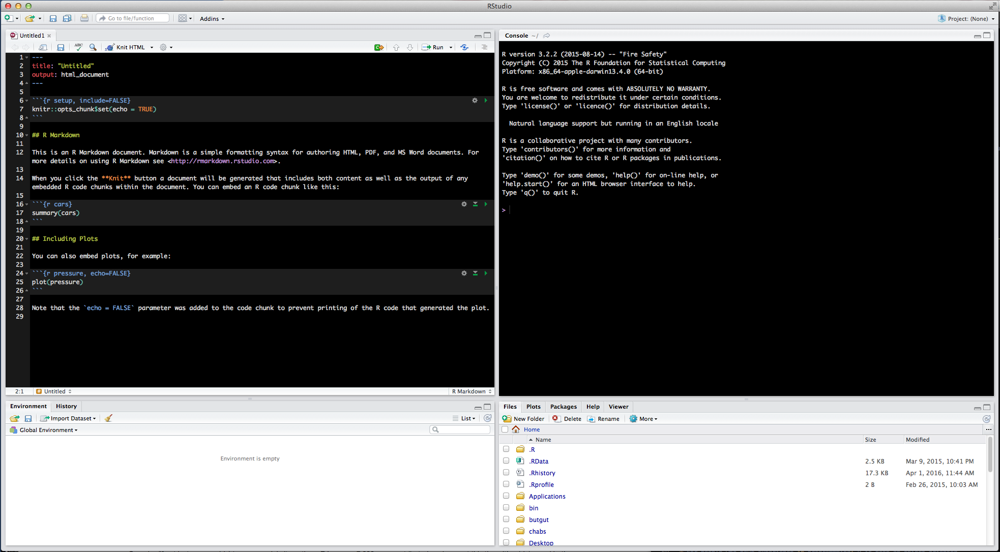

```{r, echo=FALSE, purl=FALSE}
knitr::opts_chunk$set(results='hide')
```

---

## Learning Objectives


> * Articulating motivations for using R
> * Introduce participants to the RStudio interface
> * Point to relevant information on how to get help, and understand how to ask well formulated questions

---

## Basics of R

R is a versatile, open source programming/scripting language that's useful both
for statistics but also data science. Inspired by the programming language S.

---

## Basics of R

* Open source software under GPL.
* Superior (if not just comparable) to commercial alternatives. R has over 7,000 user contributed packages at this time. It's widely used both in academia and industry.
* Available on all platforms.
* Not just for statistics, but also general purpose programming.
* For people who have experience in programmming: R is both an object-oriented and a so-called [functional language](http://adv-r.had.co.nz/Functional-programming.html)
* Large and growing community of peers.

---

# Awesome R tools

### Knitr/R-markdown
Knitr is an R library that allows you to create dynamic code reports. 

**Example:**         
[This](https://www.buzzfeed.com/peteraldhous/spies-in-the-skies?utm_term=.vw6m6GNwGa#.mwZYqXjQXv) 
BuzzFeed article, reporting on government surveillance planes, included all of their [analysis](http://buzzfeednews.github.io/2016-04-federal-surveillance-planes/analysis.html) as
an R-markdown document.

---
## Shiny
Shiny is a web application framework built for R. 

**Example:**            
[This](http://shiny.rstudio.com/gallery/movie-explorer.html) is a shiny app to visualize and explore a movie dataset. 

---
## RStudio
RStudio is an IDE- an integrated development environment. It allows us to write, execute, and debug R code. It also has several other nice features, accessible through its GUI (graphical user interface), that make it easier to use R.

RStudio is such a popular tool among R users, that several other languages have tried
to emulate it, such as Spyder for Python. 

---
# Start RStudio -- Let's start learning about our tool.

---
## RStudio 

Rstudio's layout includes 4 quadrants   
        
* Scripts        
* Console          
* Environment/History          
* Plotting/Packages/Help        
    
---



To adjust the layout of your quadrants go to Preferences > Pane Layout 

---

## Interacting with R

There are two main ways of interacting with R: using the console or by using script files (plain text files that contain your code).

---
## Console 

The console window is the place where R is waiting for you to tell it what to do, and where it will show the results of a command.  

You can type commands directly into the console, but they will be forgotten when you close the session. 

It is better to enter the commands in the script editor, and save the script. 

This way, you have a complete record of what you did, you can easily show others how you did it and you can do it again later on if needed. 


---

## Console 

You can copy-paste into the R console, but the Rstudio script editor allows you to 'send' the current line or the currently selected text to the R console using the `Ctrl-Enter` shortcut.

If R is ready to accept commands, the R console shows a `>` prompt. 

If it receives a command (by typing, copy-pasting or sent from the script editor using `Ctrl-Enter`), R will try to execute it, and when ready, show the results and
come back with a new `>`-prompt to wait for new commands.

---
## Console

If R is still waiting for you to enter more data because it isn't complete yet, the console will show a `+` prompt. 

It means that you haven't finished entering
a complete command. 

This is because you have not 'closed' a parenthesis or
quotation.

If you're in Rstudio and this happens, click inside the console
window and press `Esc`; this should help you out of trouble.

---

## Seeking help

### I know the name of the function I want to use, but I'm not sure how to use it

If you need help with a specific function, let's say `barplot()`, you can type:

```{r, eval=FALSE}
?barplot
```


---

## Seeking help

If you just need to remind yourself of the names of the arguments, you can use:

```{r, eval=TRUE}
args(lm)
```

---

## Seeking help

If the function is part of a package that is installed on your computer but don't remember which one, you can type:

```{r, eval=FALSE}
??geom_point
```

---

## Seeking help

### I want to use a function that does X, there must be a function for it but I don't know which one...

If you are looking for a function to do a particular task, you can use
`help.search()` (but only looks through the installed packages):

```{r, eval=FALSE}
help.search("boxplot")
```

---
## Seeking help

If you can't find what you are looking for, you can use the
[rdocumention.org](http://www.rdocumentation.org) website that search through
the help files across all packages available.

---

## Seeking help

### I am stuck... I get an error message that I don't understand

Start by googling the error message. However, this doesn't always work very well because often, package developers rely on the error catching provided by R. You
end up with general error messages that might not be very helpful to diagnose a problem (e.g. "subscript out of bounds").

---

## Seeking help

However, you should check stackoverflow. Search using the `[r]` tag. Most
questions have already been answered, but the challenge is to use the right words in the search to find the answers:
[http://stackoverflow.com/questions/tagged/r](http://stackoverflow.com/questions/tagged/r)

---

## Seeking help

The [Introduction to R](http://cran.r-project.org/doc/manuals/R-intro.pdf) can
also be dense for people with little programming experience but it is a good
place to understand the underpinnings of the R language.

The [R FAQ](http://cran.r-project.org/doc/FAQ/R-FAQ.html) is dense and technical
but it is full of useful information.

---

### Asking for help

See the "asking for help" and "Where to ask for help?" section in [https://github.com/DattaHub/BeginneR/blob/master/PDF/01-what-is-R.pdf](https://github.com/DattaHub/BeginneR/blob/master/PDF/01-what-is-R.pdf)


---

### More resources

* The [Posting Guide](http://www.r-project.org/posting-guide.html) for the R
  mailing lists.
* [How to ask for R help](http://blog.revolutionanalytics.com/2014/01/how-to-ask-for-r-help.html)
  useful guidelines
  
  
---


# Now let's try some basic R codes. 

